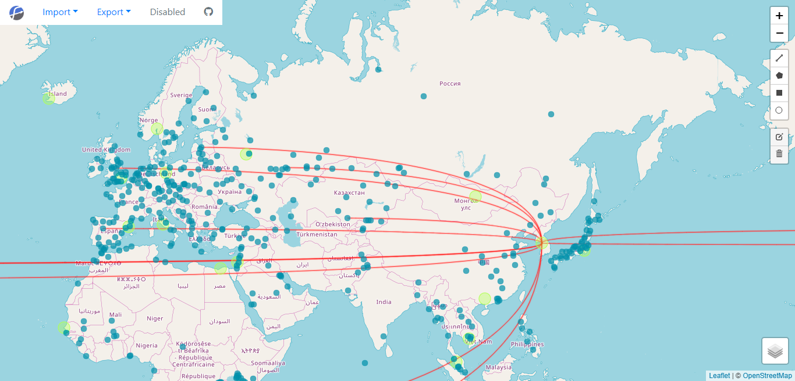

## Flow Map

Simple tools for visualize geometry, trajectory and network.

### Basic layers

There are three basic layers to build the map: Geometry, Trajectory and Network. You can choose the layers you want to display and edit by switching layer control in the bottom right corner.

### Background tile layers

You can choose specific background layers depending by yourself. Flow Map provides 6 background options: Empty, Street, Topography, Gray Style, Light Color and Dark Matter.

### Functionality

- **Display and edit vector geometries:** You can import shp files in zip format and geojson files to Flow Map and use buttons in the right side of the map to edit and create geometries. 
- **Display trajectory:** Import GPX file and Flow Map will show the trajectory and the movement.
- **Display Network:**  Open Network Layer and import network data. Flow Map will demonstrate the origins, destinations and the flow networks.
- **Export files:** You can export your shp, geojson files and images.
- **Edit:** You can draw polylines ,polygons , rectangles or circlemarkers based on your needs. Of course, you can also cancel your editing if you feel that is unnecessary or false.
- **Analyze:** Based on the trajectories you import ,Flow map can analyze the stay point.

### Contributor

@ShangSS@GXIU@GuoJX@XingXY@GongXR